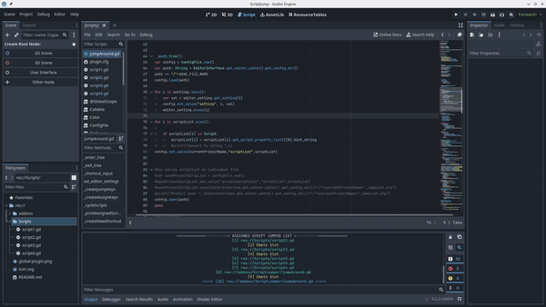

# Script Jumper
Jump Around through assigned Scripts Lists

## Installation:
- Download and unzip the plugin at `res://`, in the end your project should have this path: `res://addons/ScriptJumper`.
- Make sure to enable the plugin at `Project -> Project Settings -> Plugins`

## Default Keybinds:
Default `JumpKeys` - `1,2,3,...0`

Jump To - `Alt + JumpKeys`.

Assign Script - `Ctrl + Alt + JumpKeys`

Cycle Next - `Alt + E`

Cycle Previous - `Alt + Q`

Show Assigned Scripts - `Alt + W`

## Preview:

